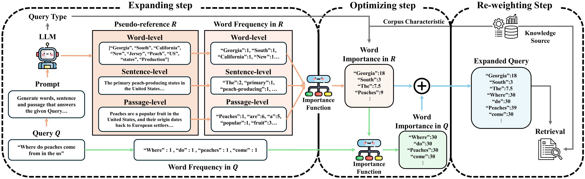

# Word2Passage: Word-level Importance Re-weighting for Query Expansion

<div align="center">


**Official repository for the paper "Word2Passage: Word-level Importance Re-weighting for Query Expansion"**

</div>

## 📑 Abstract

Retrieval-augmented generation (RAG) enhances the quality of LLM generation by providing relevant chunks, but retrieving accurately from external knowledge remains challenging due to missing contextually important words in query. We present **Word2Passage**, a novel approach that improves retrieval accuracy by optimizing word importance in query expansion. Our method generates references at word, sentence, and passage levels for query expansion, then determines word importance by considering both their reference level origin and characteristics derived from query types and corpus analysis. Specifically, our method assigns distinct importance scores to words based on whether they originate from word, sentence, or passage-level references. Extensive experiments demonstrate that Word2Passage outperforms existing methods across various datasets and LLM configurations, effectively enhancing both retrieval accuracy and generation quality. The code will be released publicly.



## 🚀 Setup

Follow these commands to set up the environment:

```bash
# Create a new conda environment with Python 3.9
conda create -n w2p python==3.9

# Activate the newly created conda environment
conda activate w2p

# Move to the project directory
cd Word2Passage-main

# Install required libraries
pip install -r requirements.txt
```

## 📊 Datasets

### 📥 Download Instructions

Use the commands below to download the datasets. This may take some time depending on the file sizes.  
To download a specific dataset, use the `-dataset` argument (e.g., `-dataset trec-covid`).

> **⚠️ Important:** If `-task` is set to **IR**, the dataset must come from the IR list. If `-task` is set to **QA**, the dataset must come from the QA list.

<table>
  <tr>
    <th width="50%"><b>IR Datasets</b></th>
    <th width="50%"><b>QA Datasets</b></th>
  </tr>
  <tr>
    <td>
      ✓ <b>dl19</b> (DL19)<br>
      ✓ <b>dl20</b> (DL20)<br>
      ✓ <b>trec-covid</b> (Covid)<br>
      ✓ <b>webis-touche2020</b> (Touche)<br>
      ✓ <b>scifact</b> (Scifact)<br>
      ✓ <b>nfcorpus</b> (NFC)<br>
      ✓ <b>arguana</b> (Arguana)<br>
      ✓ <b>scidocs</b> (Scidocs)<br>
      ✓ <b>hotpotqa</b> (Hotpot)<br>
      ✓ <b>nq</b> (NQ)<br>
      ✓ <b>fiqa</b> (FiQA)
    </td>
    <td>
      ✓ <b>hotpotqa</b> (Hotpot)<br>
      ✓ <b>nq</b> (NQ)<br>
      ✓ <b>fiqa</b> (FiQA)<br>
      ✓ <b>squad</b> (SQuAD)<br>
      ✓ <b>trivia</b> (Trivia)
    </td>
  </tr>
</table>

```bash
# Download the corpus for QA datasets
bash get-psgs_w100.sh

# Download IR datasets (e.g., "all" or other datasets such as "trec-covid")
python get_IR_dataset.py -dataset all

# Download QA datasets
python get_QA_dataset.py
```

### 📚 Wikipedia Corpus (psgs_w100, ~13GB) Indexing

Create a Lucene index for the Wikipedia corpus:

```bash
python LuceneSearch_indexer.py -corpus_name psgs_w100
```

> **💾 Note:** This indexing step requires approximately **20GB** of storage, so ensure you have sufficient disk space.

<div align="center">
  <h1>📋 1. Using Word2Passage for Your Own Dataset</h1>
  <p><i>Follow these steps to apply Word2Passage on your own dataset</i></p>
</div>
Please prepare your own <br>
a) Corpus dataset <br>
b) Query Train dataset

### 1.1 Document Indexing 📑

If you want to index your own corpus using Pyserini, store your corpus as a **TSV file** with the following two columns:

- **id**: A unique identifier for each document
- **text**: The textual content to be indexed

<details>
<summary>Example TSV format (click to expand)</summary>

```
id    text
0     This is the text of the first document.
1     This is the text of the second document.
2     ...
```
</details>

Place this TSV file in the directory:  
```
./datasets/data/your_corpus_name.tsv
```

Then run the indexer with your custom corpus name:

```bash
python LuceneSearch_indexer.py -corpus_name your_corpus_name
```

### 1.2 Grid Search 🔍

Before performing Grid Search, prepare your own training dataset in JSON format:

<details>
<summary>Training data format (click to expand)</summary>

```json
{"qid": "1", "query_text": "query1", "answers": ["answer1"], "GT_chunk": ["Ground Truth Chunk1"]}
{"qid": "2", "query_text": "query2", "answers": ["answer2"], "GT_chunk": ["Ground Truth Chunk2"]}
{"qid": "3", "query_text": "query3", "answers": ["answer3"], "GT_chunk": ["Ground Truth Chunk3"]}
```
</details>

> **💡 Tip:** If you don't have a training dataset or want to skip this step, our paper's Appendix shows that setting equal importance to all reference levels also outperforms other methods.

Save your JSON file at:
```
./datasets/user_data/train_subsample_processed.json
```

Generate pseudo references for training queries:
```bash
python W2P_pseudo_generator.py -LLM <model>
```

**Available models:** `Llama3.1_8b`, `Qwen2.5_7b`, `Qwen2.5_72b`

Then run grid search:
```bash
python grid_search.py -LLM <model> -corpus_name your_corpus_name
```

### 1.3 Interactive Mode 💬

Answer the given Queries interactively with Word2Passage using your own corpus:
```bash
python main.py -LLM <model> -corpus_name your_corpus_name
```

---

<div align="center">
  <h1>📈 2. Reproducing Paper Results</h1>
  <p><i>Follow these steps to replicate the experiments from our paper</i></p>
</div>

To test Trec-covid dataset, please follow the example codes.

### 2.1 Generate Pseudo References 📝

Use Large Language Models to generate pseudo references for a given dataset:

```bash
python pseudo_generator.py -dataset <dataset> -task <task> -LLM <model>
```

<table>
  <tr>
    <th>Parameter</th>
    <th>Options</th>
  </tr>
  <tr>
    <td><b>task</b></td>
    <td><code>IR</code> or <code>QA</code></td>
  </tr>
  <tr>
    <td><b>LLM</b></td>
    <td><code>Llama3.1_8b</code>, <code>Qwen2.5_7b</code>, or <code>Qwen2.5_72b</code></td>
  </tr>
  <tr>
    <td><b>dataset</b></td>
    <td>Choose from the appropriate dataset list based on task</td>
  </tr>
</table>

**Example:**
```bash
# IR
python pseudo_generator.py -dataset trec-covid -task IR -LLM Llama3.1_8b

# QA
python pseudo_generator.py -dataset hotpotqa -task QA -LLM Llama3.1_8b
```

### 2.2 Query Rewriting ✏️

Rewrite queries using the generated pseudo references:

```bash
python query_rewriter.py -dataset <dataset> -task <task> -LLM <model> -num <num> -alpha <alpha>
```

<table>
  <tr>
    <th>Parameter</th>
    <th>Description</th>
  </tr>
  <tr>
    <td><b>num</b></td>
    <td>Number of references to use</td>
  </tr>
  <tr>
    <td><b>alpha</b></td>
    <td>Weight for pseudo references</td>
  </tr>
</table>

**Example:**
```bash
# IR
python query_rewriter.py -dataset trec-covid -task IR -LLM Llama3.1_8b -num 5 -alpha 30

# QA
python query_rewriter.py -dataset hotpotqa -task QA -LLM Llama3.1_8b -num 5 -alpha 30
```

### 2.3 Evaluate nDCG@10 Performance 📊

Evaluate IR performance (nDCG@10) of various methods with BM25:

```bash
python eval_bm25_pytrec.py -dataset <dataset> -task <task> -method <methods> -LLM <model>
```

**Available methods:** `default`, `HyDE`, `MuGI`, `W2P`

**Example:**
```bash
# IR 
python eval_bm25_pytrec.py -dataset trec-covid -task IR -method default HyDE MuGI W2P -LLM Llama3.1_8b

# QA
python eval_bm25_pytrec.py -dataset hotpotqa -task QA -method default HyDE MuGI W2P -LLM Llama3.1_8b
```

### 2.4 Retrieving for QA Datasets 🔎

Retrieve evidence passages for QA tasks using rewritten queries:

```bash
python QA_retriever.py -dataset <dataset> -method <method> -LLM <model>
```

**Example:**
```bash
python QA_retriever.py -dataset hotpotqa -method default HyDE MuGI W2P -LLM Llama3.1_8b
```

### 2.5 Evaluating QA Performance 🧪

Evaluate QA performance using the specified methods:

First, add your OpenAI API key:
```python
# Edit line 12 in evaluation.py
openai.api_key = 'your_api_key'
```

Then run the evaluation:
```bash
python evaluation.py -dataset <dataset> -method <methods> -LLM <model>
```

**Example:**
```bash
python evaluation.py -dataset hotpotqa -method default HyDE MuGI W2P -LLM Llama3.1_8b
```

---

## 🔖 Citation

If you found the accompanying code useful for your research, we kindly encourage you to cite our work in your publications.

```bash
@inproceedings{choi2025word2passage,
  author       = {Jeonghwan Choi and
                  Minjeong Ban and
                  Minseok Kim and
                  Hwanjun Song},
  title        = {Word2Passage : Word-level Importance Re-weighting for Query Expansion},
  booktitle={},
  year={2025},
  url={}
  }
```
---
<div align="center">

Feel free to adjust the arguments (dataset, task, LLM, method, etc.) based on your specific use case.

For any issues or questions, please open an issue in this repository.

</div>
